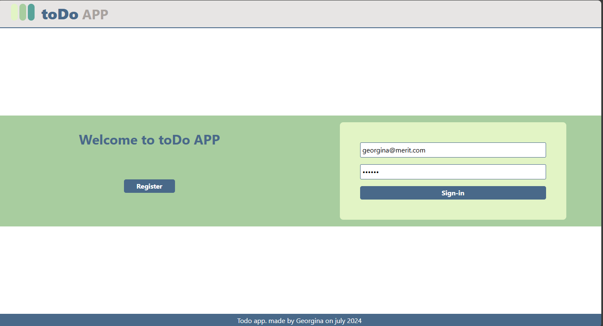
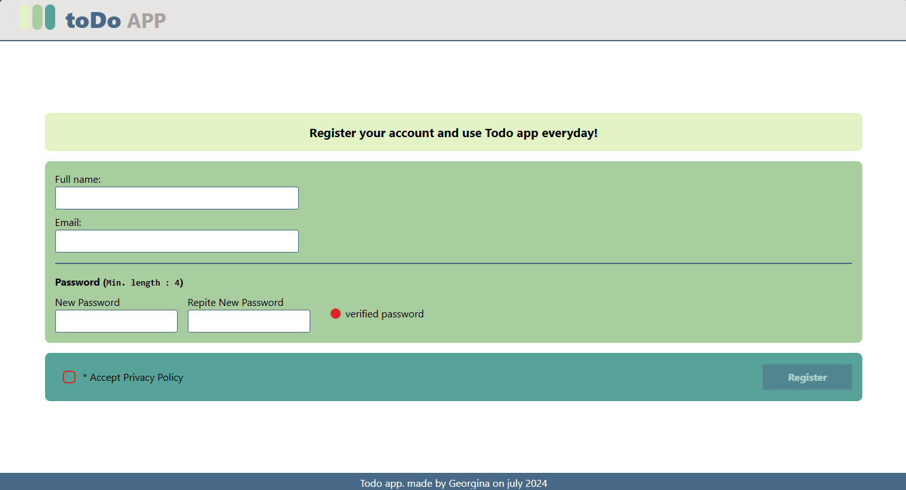
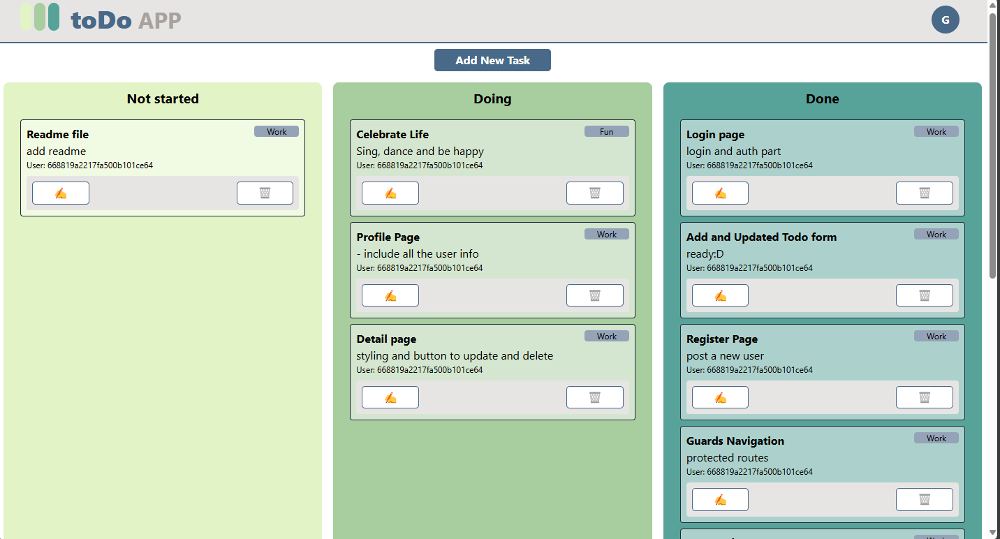

# toDo App

## Full stack application

#### Small app to keep tasks organized. Keep it simple 😊

#### Kan-ban desk with Drag and Drop.

## FRONTEND
```
cd front
npm run dev
```


Made with Vue 3 with Vite.

I've'used:

- Tailwind to styling
- Vue router for routing
- Pinia to have 3 stores: categories, status and user.

#### Routes

"/" - Login Page

"/register" - Register user view

"/auth" - Logged zone, verified user with token.Fetch with Authoritation Token

"/auth/:id" - Detail Task View

"/auth/profile" - User View with option to change password





#### ENVIROMENT 

```

.provide("hostUrl", "http://localhost:5173")
.provide("serverUrl", "http://localhost:3400/api")

```

<hr /><hr />


## BACKEND
```
cd back
npm start
```
- nodeJS, express and mongoose
- JWT (JSON Web Token)
- bcrypt to encrypt the passwords that are stored in the Mongo Atlas database.

#### Endpoints

```
"/api/users"
    POST  "/login" - Validate password with token and bcrypt
    GET   "/:id" - Response with all user information, validated with token
    POST  "/auth" - Verification token and password
```

```
"/api/todos" - all routes Authorization with token
    GET "/" - Response with all tasks for user
    GET "/:id" - get one task
    POST "/" - Create new task, task info validation with express-validator
    PUT "/:id" - Update the task with id, , task info validation with express-validator
    PATCH "/:id" - Update status of task
    DELETE "/:id" - Delete task
```

```
"/api/categories"
    GET "/" - get all categories
```
```
"/api/status"
    GET "/" - get all status
```


### MONGO DB

```
const userSchema = new mongoose.Schema(
    {
        id:{
            type: mongoose.Types.ObjectId
        },
        name: {
            type: String
        },
        email: {
            type: String
        },
        password: {
            type: String
        },
        profile: {
            type: String
        },
        active:{
            type: Boolean
        }
    },
    {
        timestamps: true,
        versionKey: false
    }
)
```
```
const todoSchema = new mongoose.Schema(
    {
        id:{
            type: mongoose.Types.ObjectId
        },
        title: {
            type: String
        },
        content: {
            type: String
        },
        user_id: {
            type: String
        },
        category_id: {
            type: String
        },
        status_id:{
            type: String
        }
    },
    {
        timestamps: true,
        versionKey: false
    }
)
```
```
const statusRouter = new mongoose.Schema(
    {
        id:{
            type: mongoose.Types.ObjectId
        },
        name: {
            type: String
        },
        color: {
            type: String
        }
    },
    {
        timestamps: true,
        versionKey: false
    }
)

const categorySchema = new mongoose.Schema(
    {
        id:{
            type: mongoose.Types.ObjectId
        },
        name: {
            type: String
        },
        color: {
            type: String
        }
    },
    {
        timestamps: true,
        versionKey: false
    }
)
```
#### ENVIROMENT
```
PORT = 3400

DB_URI = mongodb+srv://georginats6:</password/>@cluster0.ayclqfu.mongodb.net/?retryWrites=true&w=majority&appName=Cluster0

TOKEN_SECRET = </secret_word/>
```
